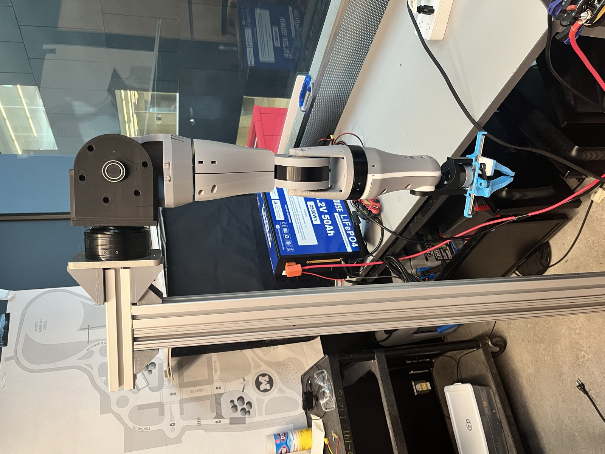
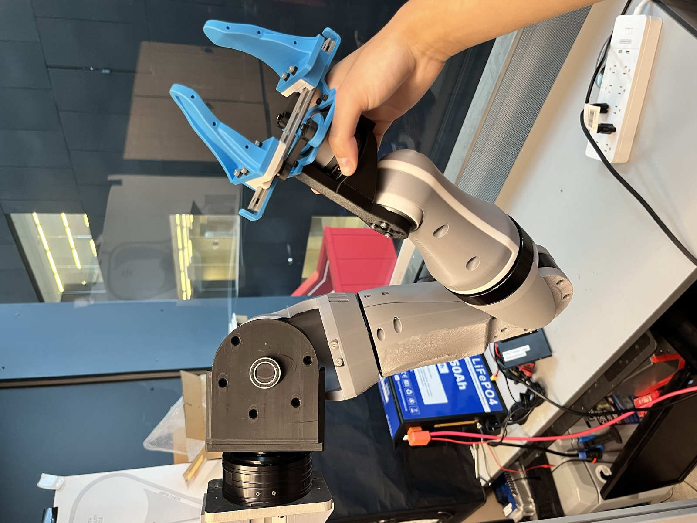
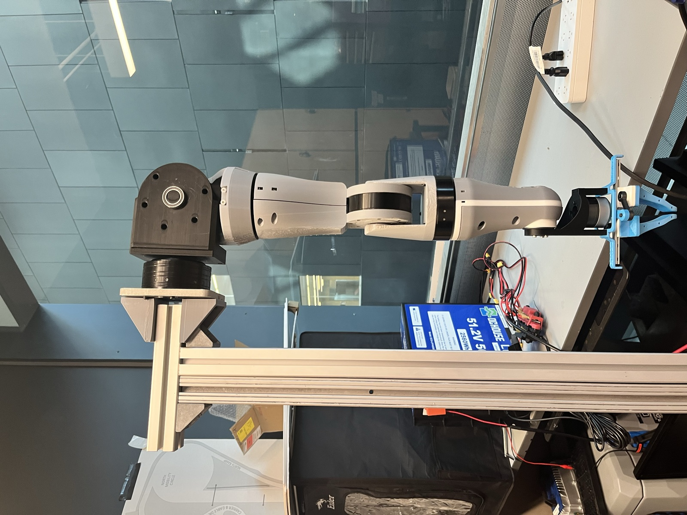
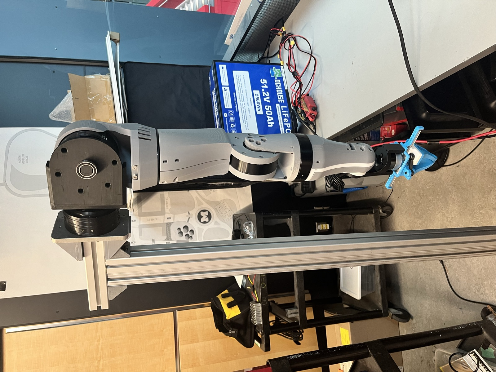
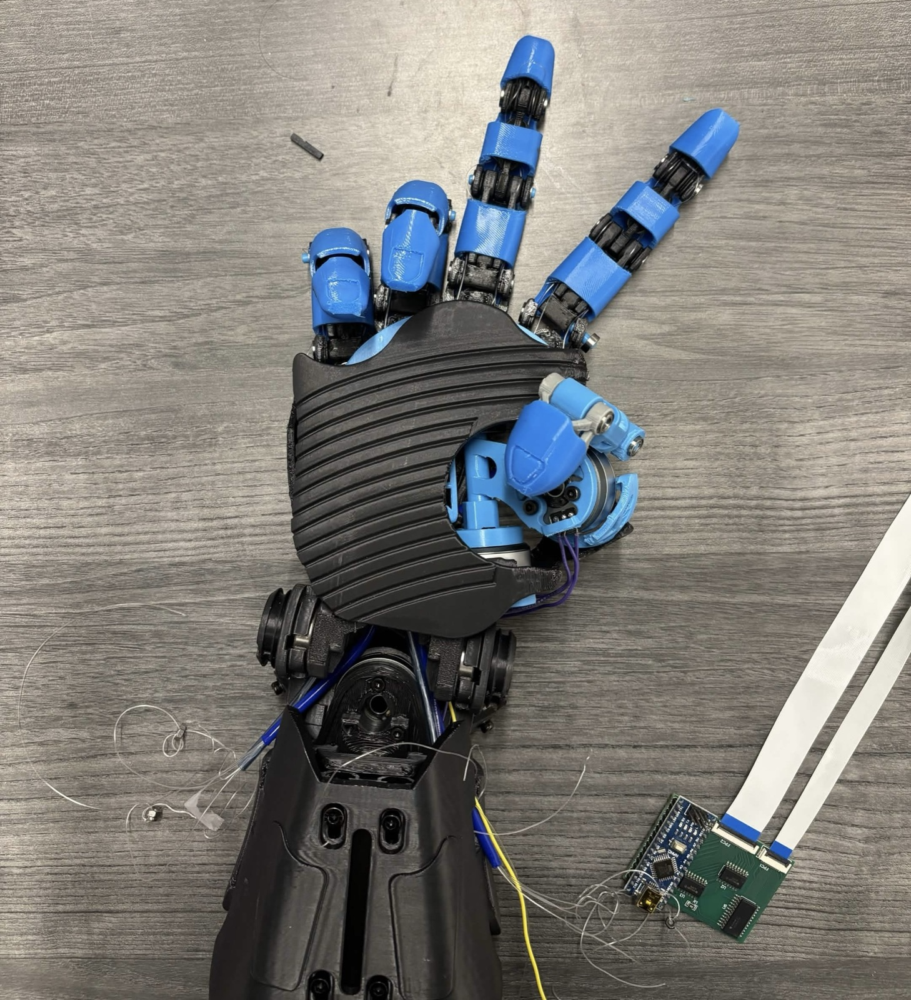

# WATonomous Humanoid Documentation


Documentation for the WATonomous Humanoid robot project at the University of Waterloo.

## Getting Started

The site lives in [`wato-humanoid-wiki/`](wato-humanoid-wiki) and is built with [Docusaurus](https://docusaurus.io/).

### Setup

```bash
cd wato-humanoid-wiki
npm install
```

### Development (with hot reload)

```bash
cd wato-humanoid-wiki
npm run start
```

This will start a local server at http://localhost:3000 that automatically rebuilds and refreshes when you make changes.

### Build (one-time)

```bash
cd wato-humanoid-wiki
npm run build
npm run serve
```






