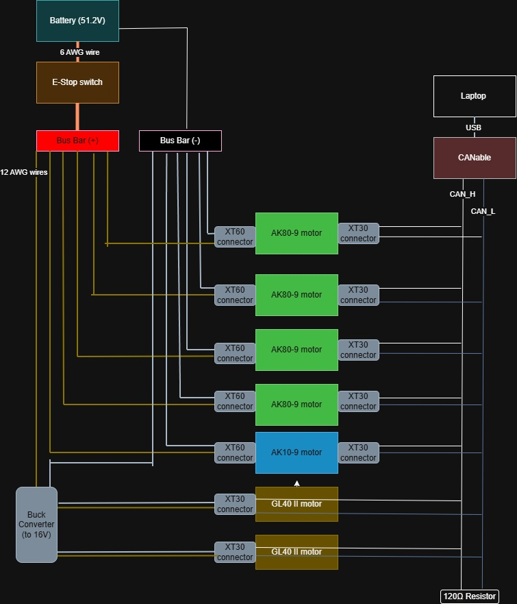

# Electrical

This page documents the power distribution and CAN bus wiring for the 6 DOF arm. The system is powered by a 51.2 V battery and controlled over CAN from a laptop via a CANable USB adapter.

## Overview

| Subsystem | Description |
| --- | --- |
| Power source | 51.2 V battery |
| Safety | E-stop on the positive rail |
| High-voltage motors | 4× AK80-9, 1× AK10-9 at 51.2 V |
| Low-voltage motors | 2× GL40 II at 16 V (via buck converter) |
| Communication | Shared CAN bus (CAN_H / CAN_L), terminated with 120 Ω |

## Power Distribution

### Battery and bus bars

Power flows from the **51.2 V battery** through an **E-stop switch** on the positive side, then to a **Bus Bar (+)**. The battery negative connects directly to **Bus Bar (−)**.

| Connection | Wire gauge |
| --- | --- |
| Battery (+) → E-stop | 6 AWG |
| E-stop → Bus Bar (+) | 6 AWG |
| Bus Bar (+) → loads | 12 AWG |
| Battery (−) → Bus Bar (−) | 6 AWG |

### Motor power

Five motors run directly from the 51.2 V bus bars via **XT60** connectors:

| Motor | Quantity | Voltage | Connector |
| --- | --- | --- | --- |
| AK80-9 | 4 | 51.2 V | XT60 |
| AK10-9 | 1 | 51.2 V | XT60 |

Two **GL40 II** motors operate at a lower voltage. A **buck converter** steps the 51.2 V bus down to **16 V**, which is delivered to both motors via **XT30** connectors.

| Motor | Quantity | Voltage | Connector |
| --- | --- | --- | --- |
| GL40 II | 2 | 16 V | XT30 |

These motors correspond to the [6 DOF arm motor selection](../mechanical/index.md): AK10-9 at the shoulder, AK80-9 at the elbow joints, and GL40 at the wrist and gripper.

## CAN Bus

All seven motors share a single CAN network for command and feedback.

### Controller

A **laptop** connects over **USB** to a **CANable** adapter, which drives the bus.

### Wiring

| Line | Function |
| --- | --- |
| CAN_H | CAN high |
| CAN_L | CAN low |

Each motor taps into CAN_H and CAN_L via **XT30** connectors. The bus is **terminated at the end** with a **120 Ω** resistor to prevent signal reflections.

## Connector Summary

| Connector | Use |
| --- | --- |
| XT60 | 51.2 V power to AK80-9 and AK10-9 motors |
| XT30 | 16 V power to GL40 II motors; CAN data on all motors |

## Wire Gauge Summary

| Application | Gauge |
| --- | --- |
| Main power (battery to E-stop, E-stop to bus bar) | 6 AWG |
| Distribution (bus bar to motors and buck converter) | 12 AWG |
