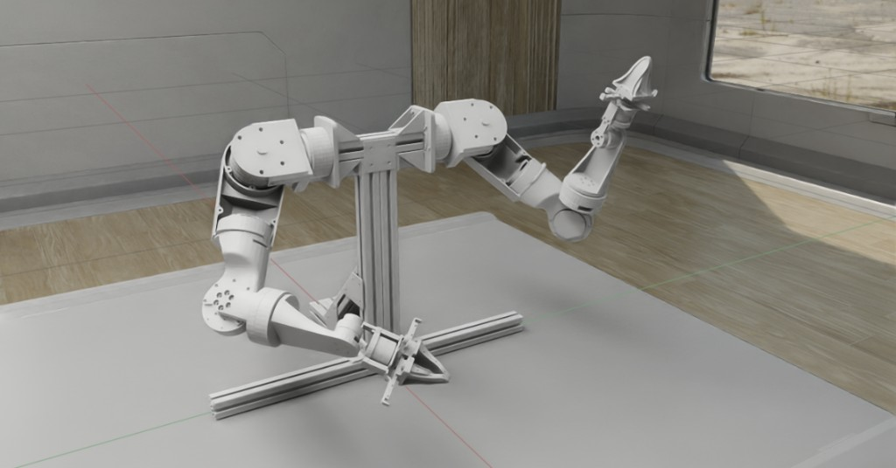
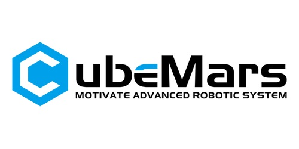

WATonomous Humanoid Documentation
=================================

Welcome to the documentation for the WATonomous Humanoid robot project at the University of Waterloo.

.. image:: https://github.com/user-attachments/assets/a0eb0a85-b723-4deb-8ce3-205a1087f7e9
   :width: 500px
   :alt: WATonomous Humanoid robot

.. image:: https://github.com/user-attachments/assets/d4561965-7219-4609-aca3-cb7a7f88d7c7
   :width: 500px
   :alt: WATonomous Humanoid robot

.. image:: https://github.com/user-attachments/assets/2dedaca1-71f3-4fa5-b9f4-8eeaffa435e8
   :width: 500px
   :alt: WATonomous Humanoid robot

.. toctree::
   :maxdepth: 2
   :caption: Sections

   mechanical/index.md
   electrical/index.md
   interfacing/index.md
   firmware/index.md
   software/index.md
   gallery/index.md
   links/index.md

Sponsors
--------

We'd like to thank `CubeMars <https://www.cubemars.com/>`_ for their generous support of the WATonomous Humanoid project.

Editing This Documentation
--------------------------

All documentation is written in plain Markdown under the ``docs/`` directory.
You can click the **Edit on GitHub** button in the top right corner of any page to edit it directly in the GitHub editor.

Contact
-------

Questions or contributions? Reach out to `hycheng@uwaterloo.ca <mailto:hycheng@uwaterloo.ca>`_.
