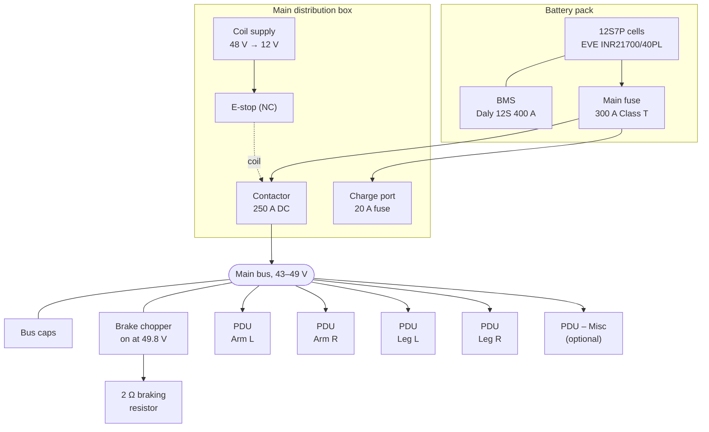

# Electrical

This page documents the electrical system of the WATonomous Humanoid:

- **[Power Architecture](#power-architecture)**: the planned full-body system. A 12S7P battery pack feeds a main distribution box, which feeds one PDU per limb.
- **[Arm Test Setup](#arm-test-setup)**: the current bench setup for the 6 DOF arm, powered from a 51.2 V battery and controlled over CAN from a laptop via a CANable USB adapter.
- **[Power Distribution Unit (PDU)](#power-distribution-unit-pdu)**: the custom board being designed for each limb.

## Power Architecture

The full humanoid runs from a single **12S7P lithium-ion battery pack**. Its voltage is set by the CubeMars motor drivers, which accept **18 to 52 V**. A 13S pack would reach 54.6 V at full charge, so the pack is 12S.

### Battery pack

| Parameter | Value |
| --- | --- |
| Cells | EVE INR21700/40PL (84 in pack, 7 spare) |
| Configuration | 12S7P |
| Nominal voltage | 43.2 V (12 × 3.60 V) |
| Charge ceiling | 49.0 V (4.08 V/cell), set on the charger CV setpoint |
| Practical low-voltage cutoff | 36.0 V (3.00 V/cell) |
| Capacity | 28.0 Ah |
| Energy | 1210 Wh total, ~1006 Wh usable |
| Estimated runtime | ~25 min at 2284 W |
| Estimated mass | 8 to 9 kg with holders, interconnects, BMS and case |
| Cell interconnect | EMS SIGMACLAD 60, 0.20 mm, with a fuse neck at every cell |

The pack averages about 41 V in service, below the motors' 48 V rating. Torque is current-limited and unaffected, but top-end speed headroom drops by roughly 10%.

### Current budget

| Condition | Pack current | Per cell |
| --- | --- | --- |
| Average continuous | ~53 A | ~7.6 A |
| Coincident peak (30% of actuators peaking at once) | ~249 A | ~35.6 A |
| Pack cell-limited ceiling | 490 A | 70 A |
| Theoretical all-actuator peak | ~831 A | ~119 A, **exceeds the cell rating** |

The 30% simultaneity figure is an assumption about the controller, not a property of the battery. The motion controller must enforce a pack-level current budget, derating torque as aggregate current approaches the limit. The BMS must not be the thing that catches it: a BMS trip mid-motion drops the robot.

Total pack resistance is estimated at ~36 mΩ, so a 249 A peak sags the bus by ~9 V. Undervoltage detection must use a filtered average, and available power should be derated as state of charge falls.

### Main distribution box

| Component | Role |
| --- | --- |
| Main fuse, 300 A Class T | Pack-level fault protection. Sits above the 249 A peak and below the BMS's 600 A overcurrent trip, so it clears real faults first |
| BMS, Daly RS-NMC-12S-400A | Cell monitoring, balancing and slow backstop protection (~1 s overcurrent delay). Not the fast protection |
| Contactor, 250 A DC | Main power switch. Its coil runs from a 48 V → 12 V supply through the e-stop |
| E-stop (normally closed) | Breaks the contactor coil circuit, which opens the contactor |
| Precharge resistor | Charges the bus capacitance before the contactor closes, so contacts and connectors are not welded by inrush |
| Bus capacitors | Bulk capacitance on the main bus |
| Brake chopper + 2 Ω resistor | Dumps regenerated energy into a 2 Ω / 400 W resistor when the bus reaches 49.8 V |
| Charge port, 20 A fuse | Separately fused charging input |
| Manual service disconnect | Lets a person break the series chain before working on the pack |

### Voltage thresholds

All the overvoltage thresholds sit between the charge ceiling and the 52 V driver limit:

| Threshold | Voltage | Set by |
| --- | --- | --- |
| Driver absolute maximum | 52.0 V | CubeMars |
| PDU hot-swap overvoltage | 51.0 V | Each PDU |
| BMS cell overvoltage (worst case) | 50.4 V | BMS (4.25 V/cell, −0.05 V tolerance) |
| Brake chopper on | 49.8 V | Main-bus chopper |
| Charge ceiling | 49.0 V | Charger CV setpoint |
| BMS cell undervoltage | 33.8 V | BMS (12 × 2.82 V) |

The brake chopper must fire before the BMS overvoltage trip, and the BMS trips on the **highest single cell**. Pack balance is therefore part of regen protection. Under worst-case braking the bus is expected to peak at 50.3 to 50.8 V, leaving only **1.2 to 1.7 V** of margin to the driver limit. This is the tightest margin in the design and must be verified on a scope.

### Wiring and connectors

| Item | Spec |
| --- | --- |
| Main pack leads | 6 AWG silicone, high strand count |
| Main pack connectors | Anderson SB175 or Amphenol Surlok Plus 8 mm. XT90 and XT150 are **not** rated for the 249 A peak |

## Arm Test Setup

The 6 DOF arm is currently tested on the bench with a simpler setup: a 51.2 V battery, an e-stop and bus bars, with no PDU. It will move onto the power architecture above once the pack and PDUs are built.

### Overview

| Subsystem | Description |
| --- | --- |
| Power source | 51.2 V battery |
| Safety | E-stop on the positive rail |
| High-voltage motors | 3× AK80-9, 2× AK10-9 at 51.2 V |
| Low-voltage motors | 2× GL40 II at 16 V (via buck converter) |
| Communication | Shared CAN bus (CAN_H / CAN_L), terminated with 120 Ω |

### Battery and bus bars

Power flows from the **51.2 V battery** through an **E-stop switch** on the positive side, then to a **Bus Bar (+)**. The battery negative connects directly to **Bus Bar (−)**.

| Connection | Wire gauge |
| --- | --- |
| Battery (+) → E-stop | 6 AWG |
| E-stop → Bus Bar (+) | 6 AWG |
| Bus Bar (+) → loads | 12 AWG |
| Battery (−) → Bus Bar (−) | 6 AWG |

### Motor power

Five motors run directly from the 51.2 V bus bars via **XT60** connectors:

| Motor | Quantity | Voltage | Connector |
| --- | --- | --- | --- |
| AK80-9 | 3 | 51.2 V | XT60 |
| AK10-9 | 2 | 51.2 V | XT60 |

Two **GL40 II** motors operate at a lower voltage. A **buck converter** steps the 51.2 V bus down to **16 V**, which is delivered to both motors via **XT30** connectors.

| Motor | Quantity | Voltage | Connector |
| --- | --- | --- | --- |
| GL40 II | 2 | 16 V | XT30 |

These motors correspond to the [6 DOF arm motor selection](/mechanical): AK10-9 at the shoulder, AK80-9 at the elbow joints, and GL40 at the wrist and gripper.

## Power Distribution Unit (PDU)

A custom **PDU** (also called PDB, power distribution board) is being designed for each limb. Each one takes the 43–49 V main bus and adds input protection, switched and protected outputs, and a microcontroller that reports over CAN.

### Planned PDU layout

For now, the full humanoid is planned to use **four PDUs** on the main bus, one per limb, plus an **optional auxiliary power board**:

| Board | Count | Powers |
| --- | --- | --- |
| Arm PDU | 2 | One per arm (left and right) |
| Leg PDU | 2 | One per leg (left and right) |
| Auxiliary power board (optional) | 1 | Extra loads such as the RealSense camera, the Jetson, and possible future waist yaw actuators |

The block diagram below shows the arm PDU. Its "48 V" labels refer to the main bus, which runs from 43 to 49 V in practice.

### Input protection

The battery input (**Vin – BMS (+)** and **Vin – BMS (−)**) passes through three protection stages before reaching any load:

| Stage | Purpose |
| --- | --- |
| TVS diode | Clamps voltage transients and spikes on the input |
| Overcurrent / short circuit protection | Cuts power on excessive current draw or a short |
| Overvoltage / undervoltage protection | Disconnects the rails when the input leaves the safe voltage window. The hot-swap overvoltage trip is 51.0 V |

### Logic power and control

| Block | Function |
| --- | --- |
| 48 V → 5 V buck | Steps the protected input down to 5 V |
| 5 V → 3.3 V LDO | Provides a clean 3.3 V rail for the logic |
| Microcontroller | Monitors the board and commands the output load switches |
| CAN interface | Connects the microcontroller to the arm CAN bus |
| Load switch controller | Driven by the microcontroller over I²C; drives the EN pins of both load switches |

### Outputs

| Output | Path | Loads |
| --- | --- | --- |
| 48 V (+ / −) | Load switch → hotswap protection → output | AK80-9 and AK10-9 motors |
| 16 V (+ / −) | EMI filter → 48 V to 16 V buck → load switch → e-fuse → output | GL40 II motors (e-fuse sized for 4 motors) |

- **Load switches** let the microcontroller enable or disable each rail independently.
- **Hotswap protection** on the 48 V rail limits inrush current when motors are connected or the rail is enabled.
- The **EMI filter** ahead of the 16 V buck keeps switching noise off the main 48 V rail.
- The **e-fuse** on the 16 V rail provides fast overcurrent protection for the low-voltage motors.

## CAN Bus

All seven motors share a single CAN network for command and feedback.

### Controller

A **laptop** connects over **USB** to a **CANable** adapter, which drives the bus.

### Wiring

| Line | Function |
| --- | --- |
| CAN_H | CAN high |
| CAN_L | CAN low |

Each motor taps into CAN_H and CAN_L via **XT30** connectors. The bus is **terminated at the end** with a **120 Ω** resistor to prevent signal reflections.

## Connector Summary

| Connector | Use |
| --- | --- |
| XT60 | 51.2 V power to AK80-9 and AK10-9 motors |
| XT30 | 16 V power to GL40 II motors; CAN data on all motors |
| Anderson SB175 / Surlok Plus 8 mm | Main battery pack leads (power architecture) |

## Wire Gauge Summary

| Application | Gauge |
| --- | --- |
| Main pack leads (power architecture) | 6 AWG silicone |
| Main power (battery to E-stop, E-stop to bus bar) | 6 AWG |
| Distribution (bus bar to motors and buck converter) | 12 AWG |
